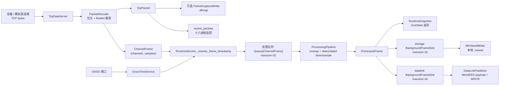

# 当前程序数据流文档

本文依据当前代码实现整理，重点描述运行时内各节点输入、输出、参数、内部处理，以及 GNSS 时间戳如何产生、对齐、兜底并传递到 MiniSEED / DataLink。

主要代码位置：

- `src/datalink_host/core/config.py`：各节点配置默认值。
- `src/datalink_host/models/messages.py`：节点之间传递的数据结构。
- `src/datalink_host/ingest/protocol.py`：TCP 二进制协议解码。
- `src/datalink_host/ingest/data_server.py`：数据 TCP 连接与包接收。
- `src/datalink_host/services/runtime.py`：运行时编排、时间戳解析、队列、处理与分发。
- `src/datalink_host/services/gnss_time.py`：GNSS 串口读数、解析和每包授时事件队列。
- `src/datalink_host/processing/pipeline.py`：相位展开与双路降采样。
- `src/datalink_host/storage/miniseed.py`：本地 MiniSEED 写盘。
- `src/datalink_host/transport/datalink.py`：DataLink 远传。

## 1. 总体链路



运行时启动时会创建并启动 GNSS 服务、存储后台 sink、DataLink 发布后台 sink、处理线程、控制 TCP 服务，然后启动数据接入服务。数据接入、GNSS 串口、处理线程、存储、远传分别在独立线程或队列中工作。

## 2. 核心数据结构

| 结构 | 产生位置 | 关键字段 | 含义 |
|---|---|---|---|
| `TcpPacket` | `PacketDecoder.feed()` | `sample_rate: float` | 包头中的源采样率 Hz。 |
|  |  | `payload_bytes: int` | 解码后的载荷字节数。 |
|  |  | `payload: bytes` | 不含包头的原始 float64 载荷。 |
|  |  | `raw_bytes: bytes` | 完整 TCP 包，供抓包和监控十六进制显示。 |
|  |  | `received_at: float` | 主机 Unix 秒时间，创建 `TcpPacket` 时默认取 `time.time()`。 |
| `ChannelFrame` | `packet_to_frame()` | `sample_rate: float` | 源采样率。 |
|  |  | `channels: np.ndarray` | 形状固定为 `(channels, samples)` 的 float64 数据。 |
|  |  | `received_at: float` | 继承自 `TcpPacket.received_at`。 |
|  |  | `timestamp_us: int | None` | Runtime 后续补入的帧起始 UTC 时间，单位微秒。 |
|  |  | `enqueued_at_monotonic: float` | 创建对象时的单调时间，用于队列等待耗时统计。 |
| `ProcessedFrame` | `ProcessingPipeline.process()` | `raw` | 原始输入数组。 |
|  |  | `unwrapped` | 相位展开后的数组。 |
|  |  | `data1` / `data2` | 两路降采样结果。 |
|  |  | `data1_sample_rate` / `data2_sample_rate` | 两路实际输出采样率。 |
|  |  | `timestamp_us` | 从 `ChannelFrame` 透传，供存储和远传使用。 |
| `RuntimeSnapshot` | `RuntimeService` | 连接、队列、错误、最新波形、基线长度、GNSS 状态 | GUI / Web / 控制连接读取的状态快照。 |

## 3. TCP 数据接入节点

### 3.1 节点参数

`DataServerSettings` 默认值：

| 参数 | 默认值 | 作用 |
|---|---:|---|
| `mode` | `client` | `client` 主动连接设备；`server` 监听设备连接。 |
| `host` / `port` | `0.0.0.0:3677` | server 模式监听地址。 |
| `remote_host` / `remote_port` | `127.0.0.1:6340` | client 模式设备地址。 |
| `recv_size` | `65536` | 单次 `recv()` 最大字节数。 |
| `reconnect_interval_seconds` | `3.0` | client 重连间隔。 |
| `connect_timeout_seconds` | `5.0` | client 连接超时。 |
| `max_packet_payload_bytes` | `8 MiB` | 单包载荷安全上限。 |
| `max_pending_buffer_bytes` | `16 MiB` | 解码器待处理缓冲区安全上限。 |

`ProtocolSettings` 默认值：

| 参数 | 默认值 | 作用 |
|---|---:|---|
| `frame_header` | `11` | 帧头值。 |
| `frame_header_size` | `2` | 帧头无符号整数字节数，可为 2/4/8。 |
| `length_field_size` | `8` | 长度字段字节数，可为 4/8。 |
| `length_field_format` | `float64` | 长度字段格式，`uint` 或 `float64`。 |
| `length_field_units` | `values` | 长度含义，`bytes` 或 float64 数值个数。 |
| `byte_order` | `big` | 包头整数、长度字段、payload float64 字节序。 |
| `channels` | `8` | 通道数。 |
| `channel_layout` | `interleaved` | 载荷排列，`interleaved` 或 `channel-major`。 |

### 3.2 输入和处理

`TcpDataServer` 从 socket 收到任意长度的 byte chunk，累计到 `PacketDecoder._buffer`。解码器按当前协议构造包头格式：

```text
frame_header: unsigned integer(frame_header_size)
sample_rate: float64
payload_length: uint/float64(length_field_size)
payload: float64[]，字节序同 byte_order
```

`payload_length` 的实际字节数计算如下：

- `length_field_units == "bytes"`：直接作为字节数。
- `length_field_units == "values"`：乘以 8，因为 payload 每个值为 float64。

帧头不匹配时会报错；如果换另一种字节序后帧头能匹配，错误信息会提示可能是 `byte_order` 配置不一致。载荷长度超过安全上限会清空 buffer 并报错。

### 3.3 输出

每个完整包产生一个 `TcpPacket`。随后 `packet_to_frame()` 把 payload 解析为 float64 数组：

- `interleaved`：payload 先 reshape 为 `(samples, channels)`，再转置为 `(channels, samples)`。
- `channel-major`：payload 直接 reshape 为 `(channels, samples)`。

输出 `ChannelFrame(sample_rate, channels, received_at)`。此时 `timestamp_us` 仍然为 `None`，由 Runtime 之后补入。

### 3.4 采样率兜底

如果包头中的 `sample_rate` 非有限值或小于等于 0：

- 若之前收到过有效采样率，则复用最后一个有效采样率，并进入 fallback 日志状态。
- 若没有历史有效采样率，则丢弃该包，不产生 `TcpPacket` / `ChannelFrame`。

## 4. Runtime 接收与时间戳补齐节点

`RuntimeService._on_packet()` 和 `_on_frame()` 是数据进入运行时后的第一层分发。

### 4.1 `TcpPacket` 分支

如果启用抓包，`_on_packet()` 写入 `.dlhcap`：

- 文件头：`DLHCAP1\n`
- 每条记录：`metadata_len + packet_len + metadata JSON + raw packet bytes`
- metadata 包含 `received_at`、`sample_rate`、`payload_bytes`

同时 Runtime 会保留最近最多 40 个包的摘要，包括 `received_at`、采样率、载荷长度、完整包长度、前 1024 字节十六进制 dump，用于 Web/GUI 监控。

### 4.2 `ChannelFrame` 分支

`_on_frame()` 先调用 `_resolve_frame_timestamp()` 得到：

```text
timestamp_us: int | None
used_fallback: bool
gnss_error: str | None
```

然后把 `timestamp_us` 写回 `ChannelFrame.timestamp_us`，并放入处理队列 `Queue[ChannelFrame]`，队列最大 32。队列满时丢弃当前帧并增加 `frames_dropped`。

如果本帧拿到了有效 `timestamp_us`，Runtime 记录：

- `_last_frame_start_us = timestamp_us`
- `_last_frame_duration_us = round(samples / sample_rate * 1_000_000)`

这两个状态会用于下一帧 GNSS 不可用时的连续时间兜底，以及 GNSS 对齐时的 expected next 计算。

## 5. GNSS 时间戳节点

### 5.1 GNSS 配置参数

`GnssSettings` 默认值：

| 参数 | 默认值 | 作用 |
|---|---:|---|
| `enabled` | `True` | 是否启用 GNSS 时间。 |
| `port` | 空字符串 | 串口设备名；为空时服务不会启动读取线程。 |
| `baudrate` | `115200` | 串口波特率。 |
| `mode` | `deploy` | `debug` 或 `deploy`，决定时间格式和是否主动轮询。 |
| `poll_interval_seconds` | `0.1` | debug 模式向设备发送命令的间隔。 |
| `timestamp_interval_seconds` | `1.0` | 旧版 cadence 配置，当前包结束授时逻辑不再用于帧打点。 |
| `packet_timestamp_timeout_seconds` | `1.0` | Runtime 收到一个 TCP 包后，等待下一条 GNSS 包结束时间戳的超时时间。 |
| `serial_timeout_seconds` | `0.1` | 串口 `readline()` 超时。 |
| `command` | `timestamp` | debug 模式轮询命令。 |

### 5.2 GNSS 串口输入格式

`gnss_timestamp_to_us(raw_value, mode)` 支持三种 UTC 字符串格式，全部转换为 Unix epoch 微秒：

| mode | 输入格式 | 示例 | 说明 |
|---|---|---|---|
| `debug` | `YYYY-MM-DD HH:MM:SS nnnnnnnnn` | `2026-04-09 13:30:32 000000010` | 纳秒字段只取前 6 位作为微秒。 |
| `deploy` | `YYYYMMDDHHMMSSffffff` | `20260409133032000000` | 14 位日期时间 + 6 位微秒。 |
| `deploy` | `YYYY-MM-DD HH:MM:SS.ffffff` | `2026-04-22 08:18:48.900000` | 点号微秒格式。 |

当前代码将这些时间都视为 UTC，不做本地时区转换。

### 5.3 GNSS 服务内部处理

GNSS 服务启动条件是 `gnss.enabled == True` 且 `gnss.port` 非空。连接串口后会先丢弃已有串口输入缓冲，避免旧时间戳污染后续帧。

读取循环行为：

- `debug` 模式：按 `poll_interval_seconds` 发送 `command + "\r\n"`，然后 `readline()`。
- `deploy` 模式：不主动发送命令，只持续 `readline()`。
- 每行解析成功后调用 `_record_timestamp(timestamp_us)`。

`_record_timestamp()` 会同时做两件事：

1. 把解析出的原始 GNSS 时间戳追加到内部事件队列 `_timestamp_events`，并唤醒等待中的 Runtime。
2. 维护旧的外推状态，供 `current_time_us()` 和兼容测试使用；当前 Runtime 打帧时间戳不再使用这个外推时间。

外推状态包括：

- `_current_timestamp_anchor_us`：当前可外推的 GNSS 锚点。
- `_last_timestamp_monotonic`：收到锚点时的本机单调时钟。

`current_time_us()` 返回：

```text
current_timestamp_anchor_us + max((time.monotonic() - last_timestamp_monotonic), 0) * 1_000_000
```

如果设备重复上报同一整秒或旧值，`_record_timestamp()` 会使用 `max(新解析时间, 当前外推时间)` 作为新的外推 anchor，保证 `current_time_us()` 不倒退。但事件队列中保存的是设备原始解析值，`GnssStatus.last_timestamp_us` 也保存设备原始解析值，用于状态展示。

### 5.4 Runtime 如何给帧分配 `timestamp_us`

`timestamp_us` 的语义是“该 `ChannelFrame` 源数据第一采样点对应的帧起始 UTC 时间，单位微秒”。Runtime 使用帧样本数和采样率计算帧时长：

```text
frame_duration_us = round(sample_count / sample_rate * 1_000_000)
```

#### GNSS 未启用

Runtime 把 `ChannelFrame.received_at` 视为“帧结束时间”，帧起始时间为：

```text
timestamp_us = round(received_at * 1_000_000) - frame_duration_us
```

如果采样率无效导致无法计算帧时长，则直接使用 `received_at` 的微秒值。

#### GNSS 启用，且可获得包结束 GNSS 时间

当前设备协议语义是：

```text
TCP 一个完整包 = 一段数据
设备传完该包后，GNSS 串口发送当前 UTC 时间
该 GNSS 时间表示包结束时间
包起始时间 = GNSS 包结束时间 - 该包数据时长
```

因此 Runtime 在收到一个 `ChannelFrame` 后，会调用：

```text
gnss_packet_end_us = GnssTimeService.wait_for_next_timestamp_us(timeout_seconds)
```

常规 `timeout_seconds` 取 `packet_timestamp_timeout_seconds` 与串口读取超时的较大值。数据连接打开或 GNSS 配置更新后的第一次授时等待，会额外按 `timestamp_interval_seconds` 放宽一次等待窗口，且初始等待至少 5 秒，避免程序刚启动、GNSS 串口线程尚未读到首条授时时过早回退。这个初始等待只消费一次；如果 GNSS 仍然没有到达，后续包回到常规超时和连续时间兜底。

如果等到了 GNSS 原始时间戳，则帧起始时间为：

```text
timestamp_us = gnss_packet_end_us - frame_duration_us
```

其中：

```text
frame_duration_us = round(sample_count / sample_rate * 1_000_000)
```

对当前现场协议，一个包时长约 1 秒时，串口返回 `12:00:01.000000`，落盘起始时间应为 `12:00:00.000000`。程序不会再把“串口读到这行文本的本机时刻”当作 GNSS 时间锚点，也不会把本机单调时钟外推出来的小数秒混入帧时间戳。

#### GNSS 启用，但当前不可用

如果 GNSS 开关启用但串口端口为空，Runtime 不会等待 GNSS 包，而是按未启用 GNSS 的路径使用 TCP 包接收时间作为帧结束时间。

若在 `timeout_seconds` 内没有等到 GNSS 包结束时间戳，但 Runtime 已有上一帧时间状态：

```text
timestamp_us = last_frame_start_us + last_frame_duration_us
used_fallback = True
gnss_error = gnss_status.last_error or "GNSS packet timestamp did not arrive ...; using previous frame timestamp fallback"
```

若 GNSS 不可用且没有上一帧可兜底，则使用 TCP 包接收时间作为首帧兜底时间，避免启动期第一帧没有时间戳导致存储和 DataLink 被跳过；状态中会标记 `gnss_fallback_active=True`。

### 5.5 状态展示中的 GNSS 时间

`snapshot.gnss_last_timestamp` 优先展示 GNSS 服务的原始 `last_timestamp_us`，格式为 `YYYYMMDDHHMMSSffffff`。它不是每帧的 `timestamp_us`；每帧实际写盘时间是该原始 GNSS 包结束时间减去包数据时长。

`snapshot.gnss_fallback_active` 来自最近一次 `_resolve_frame_timestamp()` 的 `used_fallback`。`snapshot.gnss_last_error` 来自最近一次帧时间戳解析错误，或 GNSS 服务自己的串口/解析错误。

## 6. 处理管线节点

`ProcessingPipeline.process(frame)` 输入 `ChannelFrame`，输出 `ProcessedFrame`。

### 6.1 相位展开

如果 `enable_phase_unwrap=True`：

- 首帧或通道数变化：直接对当前 `(channels, samples)` 沿 axis=1 调用 `np.unwrap()`。
- 后续帧：把上一帧每个通道的最后一个展开值拼到当前帧前面，再 `np.unwrap()`，最后去掉拼接的第一列。
- `_unwrap_last_samples` 保存当前展开结果最后一个采样点，用于下一帧。

如果关闭相位展开，则 `unwrapped = raw.copy()`，并清空 `_unwrap_last_samples`。

### 6.2 双路降采样

Data1 和 Data2 各有一个 `AverageDownsampler`，默认目标频率分别为 100 Hz 和 10 Hz。`ProcessingSettings.baseline_length_meters` 是可选物理基线长度元数据，目前不参与算法计算，只进入 Runtime 状态并在 Web 概览展示；未配置时显示为 `-`。

降采样因子：

```text
factor = round(source_rate / target_rate)
actual_output_rate = source_rate / factor
```

如果 `target_rate <= 0` 或 `target_rate >= source_rate`，不降采样，直接复制输入。

正常降采样流程：

1. 若上一帧有不足一个完整窗口的 `_carry`，先与当前 `unwrapped` 沿时间轴拼接。
2. 取可整除 `factor` 的部分。
3. reshape 为 `(channels, windows, factor)`。
4. 对每个窗口求平均，得到 `(channels, output_samples)`。
5. 剩余不足一个窗口的样本保存在 `_carry`。

`ProcessedFrame.timestamp_us` 原样继承 `ChannelFrame.timestamp_us`，处理管线不会重新计算 Data1/Data2 的起始时间。

## 7. 存储节点：MiniSEED 本地写盘

`MiniSeedWriter.write(frame)` 输入 `ProcessedFrame`，只处理 `data1` 和 `data2`，不写 raw / unwrapped。

### 7.1 输入和参数

使用 `StorageSettings`：

- `enabled` 只在 Runtime fan-out 层控制是否提交到存储 sink；`MiniSeedWriter.write()` 自身不再判断 enabled。
- `root` 为输出根目录。
- `file_duration_seconds` 决定单文件滚动边界：每个文件最多覆盖 `round(sample_rate * file_duration_seconds)` 个样本。
- `network`、`station`、`location`、`channel_codes` 写入 MiniSEED metadata 和文件名。

### 7.2 内部缓冲

每一路输出按 `(group_name, channel_index)` 单独维护 `_StreamBuffer`：

- `group_name` 为 `data1` 或 `data2`。
- `sample_rate` 为该路实际输出采样率。
- `next_segment_start` 是下一段数据应写入的起始 UTC 时间。
- `buffer_start` 是当前内存 buffer 起始 UTC 时间。
- `data` 是累积的 float32 样本。

首次收到某一路某通道有数据且 `frame.timestamp_us` 非空时：

```text
next_segment_start = UTCDateTime(frame.timestamp_us / 1_000_000)
buffer_start = next_segment_start
```

后续同一路同通道不再读取每个 `frame.timestamp_us`，而是按：

```text
next_segment_start += values.size / sample_rate
```

保持连续写盘。

如果 `frame.timestamp_us is None`，该段存储直接跳过并记录 warning。

### 7.3 输出文件

目录：

```text
{root}/Data1-01/
{root}/Data1-02/
...
{root}/Data2-01/
...
{root}/log/
```

文件名：

```text
{network}.{station}.{YYYYMMDDHHMMSSmmm}.R.{location}.{channel_code}.mseed
```

其中时间字段只保留毫秒 3 位，例如 `SC.S0001.20250205104000100.R.00.HJZ.mseed`。

MiniSEED 不再等单文件时长攒满后一次性落盘；每路通道默认攒够 1 秒样本就编码成一个 MiniSEED chunk，并以二进制追加方式写入当前单文件窗口对应的 `.mseed` 文件。达到 `file_duration_seconds` 对应的样本数后，后续 chunk 会滚动到下一个文件名。

每次追加写出一个 MiniSEED chunk 后，程序也会在与数据目录并列的 `{root}/log/` 目录写出一份同文件窗口起始时间的日志 sidecar 文件：

```text
{network}.{station}.{YYYYMMDDHHMMSSmmm}.R.{location}.LOG.log
```

日志文件内容来自程序内存日志缓冲，并带有当前 MiniSEED 文件窗口的起始 UTC 和已写入数据的结束 UTC 时间头。

MiniSEED 内容：

- 默认数据类型：float32，encoding 为 `FLOAT32`。
- 当 `storage.output_data_type=int32` 时，写出前先执行 `np.rint(value * storage.int32_gain)`，再转为 int32，encoding 为 `INT32`；默认 `storage.int32_gain=1e6`。
- `trace.stats.starttime`：buffer 起始时间。
- `trace.stats.sampling_rate`：Data1/Data2 实际输出采样率。

### 7.4 磁盘容量与滚动存储

`MiniSeedWriter.disk_usage()` 使用 `shutil.disk_usage()` 读取 `StorageSettings.root` 所在磁盘的总容量、已用容量、可用容量和利用率；如果 `root` 尚不存在，会沿父目录向上寻找已存在路径。`RuntimeService.snapshot()` 会把这些值放入运行快照，供 GUI、Web API 和控制 TCP 状态查询展示。

每次写 MiniSEED chunk 前，程序会先把 `Trace` 编码到内存中的 MiniSEED bytes，并构造对应 LOG sidecar 内容，然后用：

```text
required_bytes = len(mseed_payload) + len(log_content_utf8)
```

判断当前磁盘可用空间。如果 `free_bytes < required_bytes`，会在 `root` 下递归查找最旧的 `*.mseed` 文件并删除；当同时间戳已经没有其他 MiniSEED 文件时，同时删除 `{root}/log/` 下的 `.LOG.log` sidecar。兼容旧版本写在数据目录旁边的同名 LOG 文件，滚动清理时也会一并删除。删除后重新检查空间，直到新 MiniSEED 和 LOG 可以写入。如果已经没有可删除的 MiniSEED 文件仍空间不足，则本次写入抛出磁盘空间不足错误并进入存储 sink 的错误统计。

## 8. DataLink 远传节点

`DataLinkPublisher.publish(frame)` 输入 `ProcessedFrame`。Runtime 只有在 `datalink.enabled=True` 时才提交到 datalink sink。

### 8.1 输入选择

- 默认只发送 `data1`。
- 当 `datalink.send_data2=True` 时，也发送 `data2`。
- DataLink 发布只发送前 6 个通道，即 `HSH`、`HSZ`、`HS1`、`HS2`、`HS3`、`HS4`；最后两个温度通道 `HTH`、`HTZ` 不发布到 DataLink。
- raw / unwrapped 不发送。
- sample_rate 小于等于 0 或数据为空则跳过。
- `frame.timestamp_us is None` 时跳过该通道发送并记录 warning。

### 8.2 MiniSEED 序列化

每个 group、每个 channel 单独序列化为 MiniSEED payload：

- 默认数据转 float32，encoding 为 `FLOAT32`。
- 当 `storage.output_data_type=int32` 时，发送前先执行 `np.rint(value * storage.int32_gain)`，再转为 int32，encoding 为 `INT32`；默认 `storage.int32_gain=1e6`。
- network/station/location/channel 复用 `StorageSettings`。
- 每个 `(data1/data2, channel)` 第一次发送时用 `frame.timestamp_us / 1_000_000` 建立起始锚点，后续 payload 起始时间按 `样本数 / sampling_rate` 连续推进，与本地 MiniSEED 存储保持同一时间轴。
- `sampling_rate = data1_sample_rate` 或 `data2_sample_rate`。
- record length 根据服务端 `PACKETSIZE` 或默认 512 字节选择，范围 256 到 4096。

如果单个 MiniSEED payload 超出 DataLink 包大小限制，会按样本数递归二分；拆分后的第二段起始时间为：

```text
second_start_time = start_time + split_index / sample_rate
```

MiniSEED sequence number 在 publisher 内全局递增，最大 999999 后回绕。

### 8.3 Stream ID 和 DataLink 包

默认 `stream_id_template`：

```text
{network}_{station}_{location}_{channel}/MSEED
```

当同时发送 Data2 且模板里没有 `{group}` 时，代码会自动给 stream id 追加 `_data1` / `_data2` 后缀，避免两组数据写进同一 stream。

发送包头：

```text
WRITE {stream_id} {start_time_us} {end_time_us} {A|N} {payload_bytes}
```

外层 DataLink 编码：

```text
"DL" + 1-byte header length + ASCII header + payload bytes
```

连接建立时先发送：

```text
ID {client_id}
```

要求服务端返回以 `ID DataLink` 开头的响应，并可解析 `PACKETSIZE`。`ack_required=True` 时每次 WRITE 后等待 `OK ...` 响应，否则视为错误。

DataLink 内部还有一个发送队列，最大 512 个 `PendingDataLinkPacket`。可重试错误会保留当前 packet 并按 `reconnect_interval_seconds` 重试；永久错误会丢弃当前 packet。

## 9. 控制、Web 和 GUI 节点

这些节点主要读写 Runtime 配置和快照，不直接改变波形数组。

### 9.1 TCP 控制服务

控制服务每行读取一个 JSON，请求类型：

- `get_status`：返回 RuntimeSnapshot 摘要。
- `get_config`：返回当前配置。
- `set_config`：按 payload 更新配置。
- `set_feature`：快捷开关 `storage_enabled` / `datalink_enabled` / `gnss_enabled`。

协议、数据服务器地址、GNSS 串口参数等配置变化会更新 Runtime 内对象；协议或数据连接参数变化会重建数据接入服务。

### 9.2 Web API

FastAPI 路由：

- `GET /api/status`
- `GET /api/config`
- `POST /api/config`
- `GET /api/monitor`
- `POST /api/processing/start`
- `POST /api/processing/stop`
- `GET /api/gnss/ports`
- `POST /api/gnss/start`
- `POST /api/gnss/stop`
- `GET /api/logs`

`/api/monitor` 返回指定模式的滚动波形切片，常用查询参数：

- `mode`：`raw` / `unwrapped` / `data1` / `data2`。
- `window_seconds`：显示最近多少秒数据，默认 20 秒，范围 1 到 120 秒。
- `max_points`：单通道最多返回点数，默认和上限为 200000，用于限制高采样率下的响应大小。
- `max_packets`：最近原始包打印数量，默认 20。

各模式对应的数据源：

- `raw`：`snapshot.latest_raw`，采样率为源采样率。
- `unwrapped`：`snapshot.latest_unwrapped`，采样率为源采样率。
- `data1`：`snapshot.latest_data1`，采样率显示为配置的 `data1_rate`。
- `data2`：`snapshot.latest_data2`，采样率显示为配置的 `data2_rate`。

注意：monitor 中 Data1/Data2 的采样率显示使用配置目标值，而 `ProcessedFrame` 内实际输出采样率是 `source_rate / round(source_rate / target_rate)`。两者在源采样率不能被目标频率整除时可能不完全相同。

### 9.3 GUI

GUI 直接持有 `RuntimeService`，通过定时器刷新 RuntimeSnapshot；参数设置页调用 `runtime.update_config()`。波形显示、状态页均来自 snapshot 中的最新数组、队列状态、日志和 GNSS 状态。

## 10. GNSS 时间戳相关的现状与注意点

1. 输入 TCP 协议本身没有携带 GNSS 时间戳。包头只有 `frame_header`、`sample_rate`、`payload_length`；`timestamp_us` 是 Runtime 根据 GNSS 服务或主机接收时间后补的。

2. `timestamp_us` 表示源 `ChannelFrame` 的帧起始时间，不是接收时间，也不是帧结束时间。无 GNSS 时，代码明确把 `received_at` 当作帧结束时间并减去帧时长。

3. GNSS 原始串口时间被当作 UTC。程序不会按系统时区或中国时区转换；展示格式 `YYYYMMDDHHMMSSffffff` 也是 UTC 数字串。

4. GNSS 服务会把串口解析出的原始时间戳放入事件队列。Runtime 收到一个 TCP 包后消费下一条 GNSS 原始时间戳，把它作为包结束时间，再减去该包数据时长得到 `timestamp_us`。

5. `packet_timestamp_timeout_seconds` 决定 Runtime 等待包后 GNSS 时间戳的最长时间，默认 1 秒。GNSS 超时但已有上一帧时间时，Runtime 才用上一帧起点 + 上一帧时长继续推算。

6. GNSS 串口返回整秒时，若一个包实际正好 1 秒，则落盘文件名也应落在整秒。如果文件名仍出现 0.2 秒这类小数，优先检查包内 `sample_count / sample_rate` 是否不是 1 秒，或 Data1/Data2 降采样 carry 是否导致首次输出锚点偏移。

7. 存储节点在某个 `(data1/data2, channel)` 第一次写入后，后续不再使用每帧的 `timestamp_us`，而是按输出采样率连续推进。因此本地 MiniSEED 对短时间 GNSS 抖动不敏感，但首次锚定时间非常关键。

8. DataLink 节点同样在某个 `(data1/data2, channel)` 第一次发送后按输出采样率连续推进，保证远传 MiniSEED payload 与本地 MiniSEED 对同一输出样本使用一致的时间戳。

9. 与上一条相关，如果某一路一开始若干帧都因为 carry 不足而没有输出，等第一次真正有降采样输出时，存储和 DataLink 都会用“当前源帧”的 `timestamp_us` 锚定；这些输出可能实际包含更早帧的 carry，初始锚点也可能偏晚，但两条输出链路会保持一致。

10. 当前 `ProcessedFrame` 没有为 `data1` 和 `data2` 分别携带起始时间，只有源帧级别的 `timestamp_us`。如果后续要严格保证降采样数据的 GNSS 时间，应考虑在处理管线中产出 `data1_timestamp_us` / `data2_timestamp_us`，并由 `AverageDownsampler` 随 carry 一起维护样本时间起点。

## 11. 辅助工具链路

### 11.1 模拟发送端

`tools/sender_sim.py` 生成 `(channels, packet_samples)` 的正弦波数组，通过 `build_packet()` 按同一协议编码并定时发送。发送间隔为：

```text
packet_samples / sample_rate
```

模拟包同样不包含 GNSS 时间。

### 11.2 抓包回放

`.dlhcap` 只保存 TCP 原始包和主机 `received_at` 等 metadata。`tools/replay.py` 按抓包记录的 `received_at` 间隔回放 `packet_bytes` 到指定 TCP 地址。回放时 Runtime 会重新按当前 GNSS/主机时间策略为帧分配 `timestamp_us`，不会复用抓包时的 Runtime 帧时间戳。

### 11.3 假 DataLink 接收端

`tools/receiver_sim.py` 接收 DataLink 包，首包按 `ID` 握手，后续收到 `WRITE` 时把 payload 保存成 `packet-xxxxxx.mseed`，并返回 `OK 0 0`。
